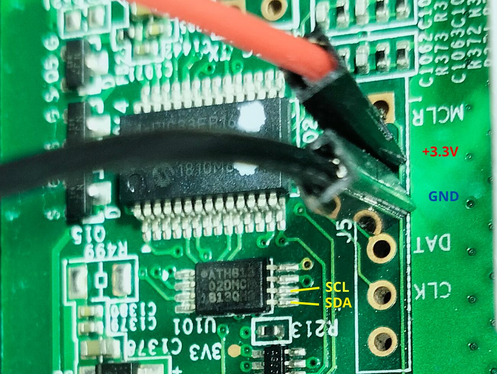

# README - Modification des Fréquences ASIC sur l'Antminer S9K avec l'eeprom 

## 1. Introduction
   - Modification des Fréquence des ASIC
   - Diminution de la consommation Électrique 
   - Diminution de la Chaleur dissipée par l'Antminer
   - Permettre d'utiliser des Ventilateurs plus silencieux
      de Type Noctua NF-A14 iPPC-3000 PWM

## 2. Cablage 

   
   - GND / + 3.3V
   - SDA / SCL
   - Utilisation du programteur de eeprom CH341


## 3. Sauvegarde de la Reprom d'Origine
   - Premièrement il est nécessaire de fair un DUMP de l'EEPROM d'origine 
   - Pour information voici Mon Eeprom Origine
   <pre>

```HEX    0  1  2  3  4  5  6  7  8  9  A  B  C  D  E  F
00000000  7e ff ff ff ff ff ff ff ff ff ff ff ff ff ff ff  |~...............|
00000010  ff ff ff ff ff ff ff ff ff ff ff ff ff ff ff ff  |................|
00000020  ff ff ff ff ff ff ff ff ff ff ff ff ff ff ff ff  |................|
00000030  ff ff ff ff ff ff ff ff ff ff ff ff ff ff ff ff  |................|
00000040  ff ff ff ff ff ff ff ff ff ff ff ff ff ff ff ff  |................|
00000050  ff ff ff ff ff ff ff ff ff ff ff ff ff ff ff ff  |................|
00000060  ff ff ff ff ff ff ff ff ff ff ff ff ff ff ff ff  |................|
00000070  ff ff ff ff ff ff ff ff ff 01 02 1f fb 28 fb ff  |.............(..|
00000080  ff ff ff ff ff ff ff c3 4d 4d 4d 4d 4d 4d 4d 4d  |........MMMMMMMM|
00000090  4d 4d 4d 4d 4d 4d 4d 4d 4d 4d 4d 4d 4d 4d 4d 4d  |MMMMMMMMMMMMMMMM|
000000a0  4d 4d 4d 4d 4d 4d 4d 4d 4d 4d 4d 4d 4d 4d 4d 4d  |MMMMMMMMMMMMMMMM|
000000b0  4d 4d 4d 4d 4d 4d 4d 4d 4d 4d 4d 4d 4d 4d 4d 4d  |MMMMMMMMMMMMMMMM|
000000c0  4d 4d 4d 4d 00 ff ff ff ff ff ff ff ff ff ff ff  |MMMM............|
000000d0  ff ff ff ff ff ff ff ff ff ff ff ff ff ff ff ff  |................|
000000e0  ff ff ff ff ff ff ff ff ff ff ff ff ff ff ff ff  |................|
000000f0  ff ff ff ff 7f 12 00 00 00 ff ff ff 39 10 6b db  |............9.k.|
```
</pre>

## 4. Voici les Adresses interesantes 
 

| Adresse | Role |
|:-----------------:|:---------------:|
|88 - C3 | Freq_Asic |
|87|U_volt_asic|
|FE - FF | CRC-16 Modbus|
|F4 - F5 | Optimal Hash rate|
|79 - 7E | Unknow|


## 5. Fréquences / HEX 

| Fréquences Mhz | HEX |~ Mh/s|
|:-----------------:|:---------------:|:---------------:|
| 385 Mhz | 4D |4620|
| 380 Mhz | 4C |4560|
| 375 Mhz | 4B |4500|
| 370 Mhz | 4A |4440|
| 365 Mhz | 49 ||
| 360 Mhz | 48 ||
| 355 Mhz | 47 ||
| 350 Mhz | 46 ||
| 345 Mhz | 45 ||
| 340 Mhz | 44 ||
| 335 Mhz | 43 ||
| 330 Mhz | 42 ||
| 325 Mhz | 41 ||
| 320 Mhz | 40 ||
| 315 Mhz | 3F ||
| 310 Mhz | 3E ||
| 305 Mhz | 3D ||
| 300 Mhz | 3C ||


## 6. Tension / HEX 

| HEX | Dec | Volt |
|:-----------------:|:---------------:|:-----------------:|
| C3 |195| 9.9 |
|BE|190|9.8|
|B9|185|9.7|
|B4|180|9.6|
|AF|175|9.5|
|AA|170|9.4|
|A5|165|9.3|

## 7. CRC 16 ModBus
   Dans les 2 adresses de fin se trouve le résultat du CRC 16 Modbus 
   Pour le calcul du CRC 16 Utiliser le Scripte suivant 
   bin_to_crc.py
   [bin_to_crc.py](bin_to_crc.py)

## 8. Optimal Hash rate
   F4 poid Faible, 
   F5 Poid Fort,
   
   Dans mon cas 127f > 4735 Mh/s / board 
   je calcule environ 12 Mhs/ Mhz en supposant que ce soit linéaire
   
   Dans le cas ou le HashRate Ideal n'est pas corectement definit 
   nous avons l'erreur suivante:

   '''
   hash_rate_guard: hash rate guard triggered! pcb_lowest_temp: 27.0, avg_rate: 11409.9 < 13897.4 in 30min
   '''
   en effet l'Antminer addition tout les Hashrates ideal et y applique une tolerance de 2 %
   Dans mon cas:

   driver-btm-soc.c:6282:need_mode2_startup: chain 0 rt_hash_rate 3892.17 ideal_hash_rate 4665
   
   driver-btm-soc.c:6282:need_mode2_startup: chain 1 rt_hash_rate 3782.22 ideal_hash_rate 4779
   
   driver-btm-soc.c:6282:need_mode2_startup: chain 2 rt_hash_rate 4002.11 ideal_hash_rate 4737

   driver-btm-soc.c:3679:check_system_work: 30 mins avg rate [11410], PCB temp [23 - 54], CHIP temp [41 - 72]
   
   driver-btm-soc.c:3449:hash_rate_guard: hash rate guard triggered! pcb_lowest_temp: 27.0, avg_rate: 11409.9 < 13897.4 in 30min

   4665+4779+4737=14181
   *0.98=13897
   
   
## 9. Remerciment

   Merci Djay pour le coup de main
   [Djay OS](https://www.djayos.com/)
   
   
